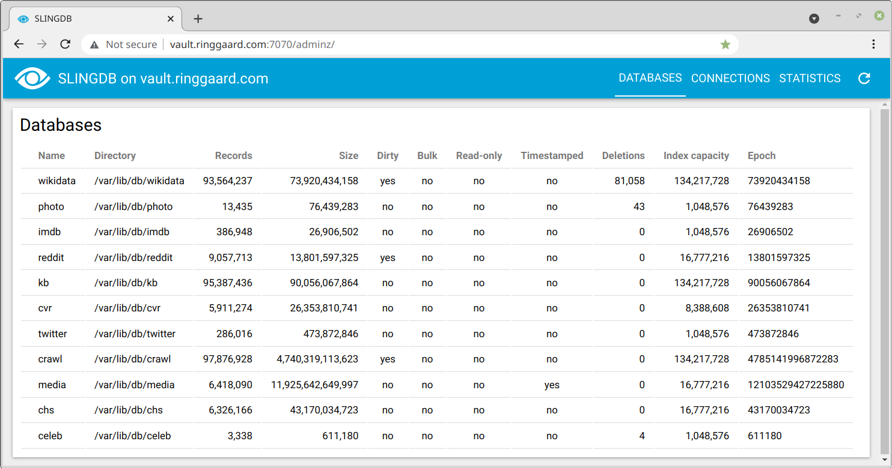

# SLINGDB

SLINGDB is a lightweight persistent key-value database with a HTTP interface.
It is basically a hash map stored on disk where you can store one value for each
key in each database. The keys and values are binary objects and SLINGDB does
not interpret the content of these. Besides the key and value, a record can
also have a 64 bit integer version number or timestamp.

## Instalation

SLINGDB can be installed independently of the other SLING components and is
distributed as a standalone Debian package which can be installed using `dpkg`
on Ubuntu 16+ or any other compatible platform with a Debian package manager and
systemd service manager:

```
curl -o /tmp/slingdb.deb https://ringgaard.com/data/dist/slingdb.deb
sudo dpkg -i /tmp/slingdb.deb
```

The SLINGDB runs as a systemd service and after installation you can check if it
is running:

```
sudo systemctl status slingdb
```

You can also start, stop, restart, enable, disable etc. the SLINGDB service
using the `systemctl` command.

The SLINGDB service is listening on port 7070 by default and you use ordinary
HTTP requests to communicate with it, e.g. you can create a new test database
with the following command:

```
curl -X POST localhost:7070/create?name=test
```

The SLINGDB server has a web-based dashboard on http://localhost:7070/adminz
that can be used for monitoring activity:



## HTTP API

You can add, update, delete and retrieve records using normal HTTP requests.
The URL for a record is `http://localhost:7070/[database]/[key]`.
The following HTTP methods are supported:

* GET
* HEAD
* PUT
* DELETE
* OPTIONS
* POST

### PUT

To add a record with the key `123` and value `hello world` you can send the
following request:

```
curl -X PUT -d 'hello world' localhost:7070/test/123
```

### GET

You can fetch a record with a standard HTTP GET request:

```
curl localhost:7070/test/123
```

### HEAD

You can use the HTTP HEAD method if you want to check if a record for a key
exists without returning the value:

```
curl --head localhost:7070/test/123
```

If the record exists, it returns HTTP status 200 and the size (Content-Length)
and version/timestamp (Version/Last-Modified) are returned in the HTTP headers.
If there is no record with this key, HTTP status 404 is returned.

### DELETE

The HTTP DELETE method is used for deleting records:

```
curl -X DELETE localhost:7070/test/123
```

### OPTIONS

The HTTP OPTIONS method returns a list of mounted databases in JSON format:

```
curl -X OPTIONS localhost:7070
```

### POST

The POST verb is used for various maintenance tasks.

#### create new database

New databases can be created with the create command:
```
curl -X POST localhost:7070/create?name=test
```

This will create a new database in `/var/lib/slingdb/test`. The database
directory is configured with `dbdir` configuration option (default is
/var/lib/slingdb). The database configuration can be specified in the request
body. The configuaration options are colon-separated key-value pairs:

* `data`: _path_ (adds data partition to database to allow database to span multiple disks)
* `initial_index_capacity`: _1M_ (set the initial capacity of the hash index)
* `index_load_factor`: _0.75_ (the index is expanded when the load factor is reached)
* `data_shard_size`: _256G_ (size of each data shard in the database)
* `buffer_size`: _4096_ (record input/output buffer size)
* `chunk_size`: _64M_ (recordio chunk size limiting the largest record that can be stored in database)
* `compression`: _1_ (0=no compression, 1=snappy compression)
* `read_only`: _false_ (static databases can be set to read-only mode)
* `timestamped`: _false_ (timestamped databases use version as modification timestamp)

#### mount database

When SLINGDB is started, it mounts all the databases in the subdirectories under
the database directory. Databases can be taken offline for maintenance.
The mount command is used for putting a database online again:

```
curl -X POST localhost:7070/mount?name=test
```

#### unmount database

A database can be taken offline with the unmount command:

```
curl -X POST localhost:7070/unmount?name=test
```

For security reasons there is no command to remove a database. To delete a
database, you first unmount it, and then manually remove the database
directory, e.g. `sudo rm -r /var/lib/slingdb/test`.

#### backup database index

The backup command makes a consistent backup of the database index which is
used to speed up database recovery after a crash:

```
curl -X POST localhost:7070/backup?name=test
```

## C++ API

You can use SLINGDB in C++ by using the `DBClient` class in
[sling/db/client.h](../../sling/db/dbclient.h). It uses the native SLINGDB
protocol for communicating with the SLINGDB server, which has lower overhead
than the HTTP protocol. The native SLINGDB protocol uses the HTTP protocol
upgrade mechanism to run on the same port as the HTTP protocol.

## Python API

The [SLING Python API](pyapi.md) has a Database class that can be used for
using SLINGDB in Python. It is built on top of the C++ native API.

#### connecting

First, you make a connection to the SLINGDB server:

```
import sling

db = sling.Database("test")
```

The database name has the general form `[<hostname>[:<port>]/]<database>`
where hostname defaults to localhost and port defaults to 7070, so `test` is
shorthand for `localhost:7070/test`.

#### reading

* `value = db[key]`<br>
  Fetch record `value` with `key` from database. Returns `None` if record does
  not exist.

* `key in db`<br>
  Check if record with `key` is in the database.

* `value, version = db.get(key)`<br>
  Fetch record with `key` and return `value` and `version` for record. Returns
  `(None, 0)` if record does not exist.

* `values = db([key1, key2, ...])`<br>
  Fetch multiple records. Returns a dictionary with the records.

#### writing

* `db[key] = value`<br>
  Add or update record in database.

* `db.put(key, value, [version=0], [mode=sling.DBOVERWRITE])`<br>
  Add or update record in database with optional `version` and `mode`. The
  `mode` parameter controls when the database is updated:
  * `sling.DBOVERWRITE` (overwrite existing records)
  * `sling.DBADD` (only add new records, do not overwrite existing ones)
  * `sling.DBORDERED` (do not overwrite records with higher version)
  * `sling.DBNEWER` (only overwrite existing record if version is newer)

  Returns outcome of the operation:
  * `sling.DBNEW` (new record added)
  * `sling.DBUPDATED` (existing record updated)
  * `sling.DBUNCHANGED` (record not updated because value is unchanged)
  * `sling.DBEXISTS` (record already exists and overwrite not allowed)
  * `sling.DBSTALE` (record not updated because version is lower)
  * `sling.DBFAULT` (record not updated because of write error)

* `db.add(key, value, [version])`<br>
  Add new record to database. This is equivalent to
  `db.put(key, value, version, mode=sling.sling.DBADD)`.

* `db.delete(key)` or `del db[key]`<br>
  Delete record in database.

#### iterating

* `for key, version, value in db([begin=0], [end=-1], [stable=False], [deletions=False])`<br>
  Returns iterator for iterating over all or parts of the database. The key is
  returned as a string if it is valid UTF-8. Otherwise it is returned as a
  byte array. The value is returned as a byte array unless it is empty in which
  case it is returned as `None`.

  If `begin` is specified, iteration starts at that position in the database.
  Otherwise the iterator starts at the beginning of the database.

  If `end` is specified, the iterator stops before that position. Otherwise
  the iterator reads until the end of the database.

  If `stable=True` the iterator stops after reading the last record when the
  iterator is created to avoid reading records updated during iteration. This
  is equivalent to setting `end=db.epoch()`.

  If `deletions=True` deleted records are returned as well. A deleted record
  has an empty value, i.e. `None`.

* `for key, version, value in db`<br>
  Iterate over all records in database. Equivalent to `db(0, -1, False, False)`.

* `for key in db.keys([begin=0], [end=-1], [stable=False], [deletions=False])`<br>
  Iterate over records in database returning keys.

* `for value in db.values([begin=0], [end=-1], [stable=False], [deletions=False])`<br>
  Iterate over records in database returning vaules.

* `for key, value in db.items([begin=0], [end=-1], [stable=False], [deletions=False])`<br>
  Iterate over records in database returning keys and values.

* `db.position()`<br>
  Returns current position after iterating over records in database.

* `db.epoch()`<br>
  Returns position for the end of the database.

# Security considerations

After installation, the SLINGDB server can only be accessed from the local
machine. If you want to access the SLINGDB server from other machines, you
need to change `/etc/slingdb/slingdb.conf`. The `addr` option can be changed
from `127.0.0.1` to the IP address of the interface you want the SLINGDB service
to listen on. If you remove the `addr` option, you can access SLINGDB from all
network interfaces. After you have changed `slingdb.conf` you need to restart
the SLINGDB service:

```
sudo systemctl restart slingdb
```

SLINGDB does not have any access control so you will probably need to run it
behind a firewall and only allow access through an application server or a
reverse proxy.

