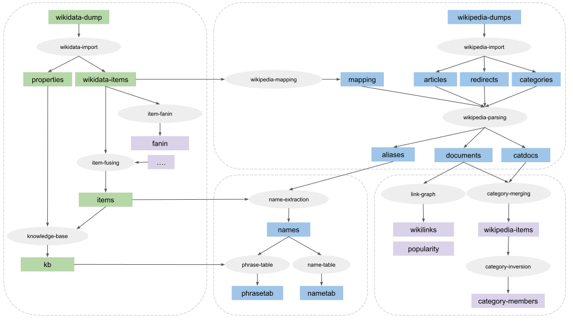

# SLING Wikipedia and Wikidata processing

SLING has a task processing pipeline for downloading and processing
[Wikipedia](https://www.wikipedia.org/) and [Wikidata](https://www.wikidata.org)
dumps. All Wikipedia pages and the Wikidata knowledge base are freely 
available as dump files from [Wikimedia](https://www.wikimedia.org/). These
dumps are processed using the SLING workflow task system to convert the dumps
into SLING frame format.

## Processing overview



The Wiki processing pipeline performs the following tasks:

  0. Download Wikidata and Wikpedia dumps
  1. Import Wikipedia dump (`wikipedia-import`)
  2. Import Wikidata dump (`wikidata-import`)
  3. Construct mapping from Wikipedia to Wikidata (`wikidata-mapping`)
  4. Wikipedia parsing (`wikipedia-parsing`)
  5. Extract and select aliases for entities from Wikidata and Wikipedia (`name-extraction`)
  6. Build name table for searching for entities (`name-table`)
  7. Build phrase table for matching phrases in text to entities (`name-table`)
  8. Merging of Wikipedia categories across languages (`category-merging`)
  9. Fusing information about items to produce final item frame (`item-fusing`)
  10. Build frame store with knowledge base (`knowledge-base`)

## Wikidata import

The Wikidata dump contains _entities_ for all the items in the knowledge base
in [JSON format](https://www.mediawiki.org/wiki/Wikibase/DataModel/JSON). The
`wikidata-import` task reads these and convert them into SLING frame format and 
stores these in a record file set. This also outputs the [schema](https://www.mediawiki.org/wiki/Wikibase/DataModel) 
for the Wikidata properties in SLING frame schema format. After this, the
`wiki-mapping` task produces a frame store that maps from Wikipedia article ids 
to Wikidata ids.

This is an example of the SLING frame for Wikidata item [Q2534120](https://www.wikidata.org/wiki/Q2534120):
```
Q2534120: {
  =Q2534120
  :/w/item
  name: "Annette Vadim"
  description: "Danish actress"
  /s/profile/alias: {=#1 name: "Annette Strøyberg" lang: /lang/pl /s/alias/sources: 2 }
  /s/profile/alias: {=#2 name: "Annette Stroyberg" lang: /lang/pl /s/alias/sources: 4 }
  /s/profile/alias: {=#3 name: "Annette Vadim" lang: /lang/pl /s/alias/sources: 4 }
  /s/profile/alias: {=#4 name: "Annette Strøyberg" lang: /lang/sv /s/alias/sources: 2 }
  /s/profile/alias: {=#5 name: "Annette Vadim" lang: /lang/sv /s/alias/sources: 4 }
  /s/profile/alias: {=#6 name: "Annette Ströyberg" lang: /lang/sv /s/alias/sources: 4 }
  /s/profile/alias: {=#7 name: "Annette Stroyberg" lang: /lang/sv /s/alias/sources: 4 }
  /s/profile/alias: {=#8 name: "Ströyberg" lang: /lang/sv /s/alias/sources: 4 }
  /s/profile/alias: {=#9 name: "Annette Strøyberg" lang: /lang/da /s/alias/sources: 2 }
  /s/profile/alias: {=#10 name: "Annette Stroyberg" lang: /lang/de /s/alias/sources: 2 }
  /s/profile/alias: {=#11 name: "Annette Vadim" lang: /lang/de /s/alias/sources: 4 }
  /s/profile/alias: {=#12 name: "Annette Susanne Strøyberg" lang: /lang/de /s/alias/sources: 4 }
  /s/profile/alias: {=#13 name: "Annette Stroyberg" lang: /lang/fr /s/alias/sources: 2 }
  /s/profile/alias: {=#14 name: "Annette Vadim" lang: /lang/fr /s/alias/sources: 4 }
  /s/profile/alias: {=#15 name: "Annette Ströyberg" lang: /lang/fr /s/alias/sources: 4 }
  /s/profile/alias: {=#16 name: "Annette Vadim" lang: /lang/es /s/alias/sources: 2 }
  /s/profile/alias: {=#17 name: "Annette Vadim" lang: /lang/en /s/alias/sources: 2 }
  /s/profile/alias: {=#18 name: "Annette Strøyberg" lang: /lang/it /s/alias/sources: 2 }
  /s/profile/alias: {=#19 name: "Annette Stroyberg" lang: /lang/it /s/alias/sources: 4 }
  /s/profile/alias: {=#20 name: "Annette Vadim" lang: /lang/it /s/alias/sources: 4 }
  /s/profile/alias: {=#21 name: "Annette Vadim" lang: /lang/nl /s/alias/sources: 2 }
  P26: {=#22 
    +Q383420
    P580: 1958
    P582: 1960
  }
  P21: Q6581072
  P40: Q5120414
  P214: "86528453"
  P569: 19361207
  P570: 20051212
  P31: Q5
  P19: Q26503
  P20: Q1748
  P345: "nm0883006"
  P646: "/m/02glbs"
  P27: Q35
  P268: "11957641t"
  P106: Q33999
  P106: Q4610556
  P735: Q18071263
  P213: "0000 0001 1476 8406"
  P269: "078776252"
  P1412: Q150
  P2163: "1556884"
  P2626: "226354"
  P227: "131987054"
  P2168: "247680"
  P2435: "496940"
  P2605: "79635"
  P2639: "4e701a210b1644db8c1758f49a8735b8"
  P1266: "8707"
  P2019: "p120187"
  P2604: "431759"
  P2387: "935189"
  P1196: Q3739104
  P244: "no00052596"
  P3430: "w64756mx"
  P3786: "11568"
  P2949: "Strøyberg-5"
  /w/item/wikipedia: {=#23 
    /lang/pl: /wp/pl/Annette_Strøyberg
    /lang/sv: /wp/sv/Annette_Strøyberg
    /lang/da: /wp/da/Annette_Strøyberg
    /lang/de: /wp/de/Annette_Stroyberg
    /lang/fr: /wp/fr/Annette_Stroyberg
    /lang/en: /wp/en/Annette_Stroyberg
    /lang/it: /wp/it/Annette_Strøyberg
  }
}
```

The item frame contains the id, name and optionally description of the item.
A `/s/profile/alias` is generated for each label and alias for the item. The 
`/w/item/wikipedia` contains the ids for each of the Wikipedia pages for the 
item in different languages. One frame slot is added for each Wikidata 
_statement_ for the item, e.g.
```
  P27: Q35
```
means [country of citizenship](https://www.wikidata.org/wiki/Property:P27) is
[Denmark](https://www.wikidata.org/wiki/Q35). Qualified statements are output
using '+' notation, e.g.
```
  P26: {=#22 
    +Q383420
    P580: 1958
    P582: 1960
  }
```
means [spouse](https://www.wikidata.org/wiki/Property:P26) is 
[Roger Vadim](https://www.wikidata.org/wiki/Q383420) with
[start time](https://www.wikidata.org/wiki/Property:P580) 1958 and
[end time](https://www.wikidata.org/wiki/Property:P582) 1960.

Schema frames for Wikidata properties encoded in a similar format:
```
P27: {
  =P27
  :/w/property
  name: "country of citizenship"
  description: "the object is a country that recognizes the subject as its citizen"
  source: /w/entity
  target: /w/item
  P31: Q18608871
  P1647: P17
  ...
}
```

## Wikipedia import

In contrast to Wikidata, the Wikipedia dumps are language-dependent, and there
is one dump per language. By default, the English Wikipedia is used, but 
multiple Wikipedias in different languages can be processed by the SLING wiki
processing pipeline.

The `wikipedia-import` task reads the Wikipedia dump and converts it into
Wikipedia articles, redirects, and categories. The Wikipedia dumps are stored
in [XML format](https://en.wikipedia.org/wiki/Help:Export) with the text of
each page encoded in [Wiki Markup Language](https://en.wikipedia.org/wiki/Wikipedia:Wiki_Markup_Language).
The `wikipedia-parsing` task takes these plus the Wikidata mapping and parses
the documents into SLING document format. All the links in the Wikipedia 
articles are converted to Wikidata ids, and redirects are resolved to the target
entity. The Wikipedia parser also outputs aliases from anchor text in the 
articles.


